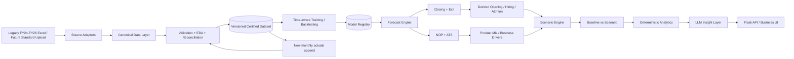

# Production architecture

## Key separation
- Upload != training.
- Scenarios != training data.
- LLM != numeric forecast model.
- Legacy sheet/column names live only in source adapters.
- All ML trains on canonical columns.
